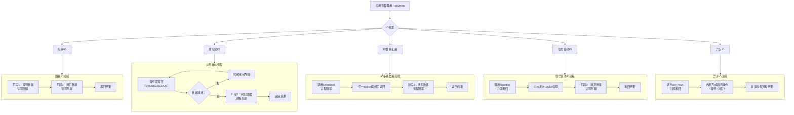

## 思考
我们知道，io 操作是阻塞的，即调用 io 操作的线程会被阻塞，直到 io 操作完成。网络 io 操作也不例外，即调用网络 io 操作的线程会被阻塞，直到网络 io 操作完成。一台网络设备每一次网络请求都阻塞，势必会影响系统的并发性能。因此，linux 一定有针对网络io操作的优化方案。


## recvfrom 系统调用
recvfrom 系统调用是用来接收网络数据的，其原型如下：
```c
ssize_t recvfrom(int sockfd, void *buf, size_t len, int flags, struct sockaddr *src_addr, socklen_t *addrlen);
```
其中，sockfd 是 socket 描述符，buf 是接收数据的缓冲区，len 是缓冲区的长度，flags 是接收数据的标志位，src_addr 是发送端的地址，addrlen 是发送端地址的长度。


## 网络io模型
linux 网络io模型有以下几种：
- 阻塞io模型
- 非阻塞io模型
- io复用模型
- 信号驱动io模型
- 异步io模型



#### 1. 阻塞IO
- **过程**：如上图“阻塞IO流程”所示，应用进程在发出 `recvfrom` 调用后，整个进程被挂起，直到数据完全准备好并从内核空间拷贝到用户空间后，调用才返回。  
- **特点**：最简单、最原始；数据准备与拷贝两阶段均阻塞。  
- **场景**：连接数少、逻辑简单；高并发需多线程/进程，但创建与切换开销大、资源消耗高。

#### 2. 非阻塞IO
- **过程**：如上图“非阻塞IO流程”所示，若内核数据未就绪，`recvfrom` 立即返回 `EWOULDBLOCK`；进程需主动轮询，直到数据就绪，随后在拷贝阶段阻塞。  
- **特点**：等待阶段非阻塞，但轮询耗 CPU。  
- **场景**：少量并发、对实时性有要求；并非高并发首选。

#### 3. IO多路复用
- **过程**：Linux 高并发核心模型。进程调用 `select` / `poll` / `epoll` 并阻塞在这些函数上，而非真正 IO 调用；它们同时监控多个 socket，任一就绪即返回，随后进程调用 `recvfrom` 完成拷贝（此阶段阻塞）。  
- **特点**：单进程/线程可处理海量连接，大幅提升并发；Reactor 模式即基于此。  
- **select · poll · epoll 对比**  
  - **select**：早期实现，默认最大 1024 连接，需遍历全部 fd，性能随连接数线性下降。  
  - **poll**：去除连接数限制，仍需遍历，性能问题依旧。  
  - **epoll**：事件通知，无需遍历，无连接数限制，Linux 最佳多路复用机制；Java NIO、Nginx、Redis 等均采用。

#### 4. 信号驱动IO
- **过程**：如上图“信号驱动IO流程”所示，进程先注册 `SIGIO` 处理函数并立即返回；内核数据就绪后发送信号，进程在信号处理函数中调用 `recvfrom`，拷贝阶段阻塞。  
- **特点**：等待阶段非阻塞，但编程复杂，实际应用较少。

#### 5. 异步IO
- **过程**：如上图“异步IO流程”所示，进程调用 `aio_read` 后立即返回，内核自行完成“等待+拷贝”全部工作，完成后发送信号通知进程。  
- **特点**：两阶段均不阻塞，真正异步。  
- **注意**：Linux AIO 支持不完善，真正异步模型使用较少；Java AIO 等在 Linux 下常由 epoll 模拟实现。